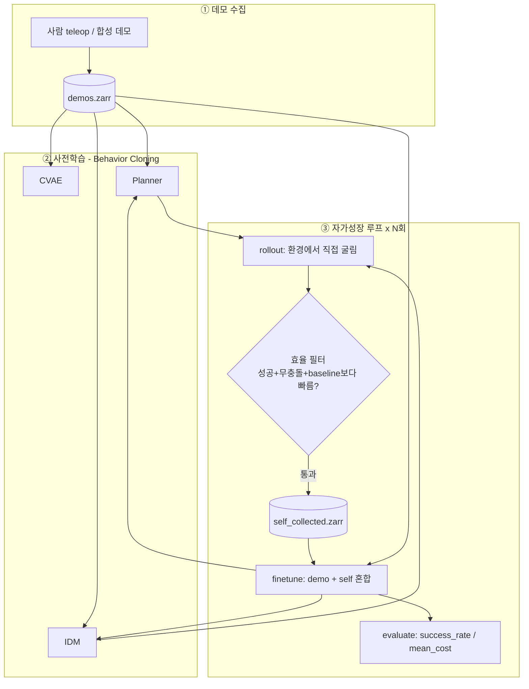

# 프로젝트 전체 구조 가이드

> 처음 이 저장소를 보는 사람이 **"이 프로그램이 무엇을, 어떤 순서로, 어떻게 동작시키는가"** 를
> 끝까지 따라갈 수 있도록 정리한 문서입니다. 코드의 모든 핵심 파일을 흐름 순서대로 설명합니다.

---

## 0. 한 줄 요약

> **비효율적인 사람 데모로 시작한 로봇이, 스스로 굴려본 궤적 중 "좋은 데이터"만 걸러
> 재학습하며 점점 효율적으로 목표에 도달하게 만드는 2D 벤치마크.**

파이프라인은 세 개의 생성 모델로 구성됩니다.

```
CVAE (잠재 표현)  +  Latent Trajectory Diffusion Planner (어디로 갈지)  +  Inverse Dynamics Diffusion (어떻게 갈지)
```

> ⚠️ **연구 목표의 최신 방향(중요)**: 초기 목표는 "지름길을 *스스로 발견*"하는 것이었으나,
> 현재는 **"어떤 데이터가 좋은 데이터인가"를 검증하는 벤치마크**로 방향이 바뀌었습니다.
> 후보 가설: *"잠재 상태 공간에서 목표 상태 방향으로 빠르게 접근하는 데이터가 좋은 데이터"*.
> 이 가설을 다른 데이터 선택 기준과 비교·검증하는 것이 지향점입니다.
> (→ 9장 "현재 상태와 로드맵" 참조. 이 벤치마크 러너는 아직 미구현 = phase 1 예정.)

---

## 1. 큰 그림: 데이터가 흐르는 순서



흐름을 말로 풀면:
1. **사람이 일부러 비효율적으로** 객체를 끌어 데모를 모은다 → `demos.zarr`.
2. 그 데모로 CVAE·Planner·IDM을 **그대로 흉내내도록(BC)** 사전학습한다.
3. 학습된 모델로 **환경에서 직접 여러 번 굴려보고(rollout)**, 그중 "성공 + 충돌 없음 + 데모 평균보다 충분히 빠름"인 궤적만 골라 별도 버퍼에 쌓고, 데모+지름길을 섞어 **재학습(finetune)** 한다. 이걸 N번 반복하며 success_rate↑ / mean_cost↓ 를 관찰한다.

---

## 2. 디렉터리 구조 (소스만, 주석 포함)

```
manipulation-benchmark/
├── main.py                      # ★ 진입점: 사전학습 + 자가성장 루프 전체 오케스트레이션
├── collect_demos.py             # ★ 인간 데모 수집: PushT식 마우스 추종 teleop
├── PROJECT_GUIDE.md             # 본 문서
│
├── config/
│   └── config.py                # 모든 하이퍼파라미터 (dataclass). Config.default()가 단일 진실원천
│
├── env/                         # ───── 2D 시뮬레이션 환경 ─────
│   ├── trajectory_explore_env.py  # ★ gymnasium Env: state/action/충돌/성공/렌더링
│   ├── svg_map.py                 # references/image.svg → 장애물·목표 폴리곤 파싱
│   └── obstacles.py               # 선분-장애물 충돌 판정 (segment_collision)
│
├── models/                      # ───── 신경망 ─────
│   ├── base.py                    # BaseGenerativeModel: DDPM 스케줄러 래퍼 (backbone 교체 지점)
│   ├── nets.py                    # MLPResNet, SinusoidalTimeEmbedding, ConditionalDenoiser
│   ├── cvae.py                    # CVAE: 궤적 구간 → 잠재 z
│   ├── latent_traj_diffusion.py   # Planner: 목표조건부 미래 state 궤적 생성 (CFG)
│   └── inverse_dynamics.py        # IDM: 인접 state 쌍 → 그 사이를 잇는 action 생성
│
├── trainer/
│   ├── trainer.py                 # ★ 학습/롤아웃 오케스트레이션 (batch 만들기 + 정규화 + rollout)
│   └── efficiency_filter.py       # baseline_cost(), is_efficient() — "좋은 데이터" 판정
│
├── data/                        # ───── 데이터 계층 ─────
│   ├── zarr_io.py                 # Zarr 저장/로드 (save_episode / load_episodes)
│   ├── replay_buffer.py           # 슬라이딩 윈도우 샘플러 (에피소드 경계 안 넘음)
│   ├── self_collected_buffer.py   # ReplayBuffer 상속, 지름길 전용 (의미 구분)
│   └── spline.py                  # 웨이포인트 → 보간 궤적 (합성 데모 생성용)
│
├── scripts/                     # [하네스 전용, git-ignore] execute.py / merge_to_main.py 등
│
├── utils/
│   ├── device.py                  # get_device(): cuda → mps → cpu fallback
│   └── normalize.py               # ★ state/obs를 [-1,1]로 정규화 (학습 성패의 핵심)
│
├── tests/                         # pytest 단위 테스트
└── experiment_records/            # 의미 있는 변경마다 기록
```

> ⚠️ `scripts/`, `docs/`, `.claude/`, `phases/`, `CLAUDE.md`는 하네스 설계상 **git-ignore되어
> GitHub에 올라가지 않습니다** (로컬 전용). 공유·재현되어야 하는 코드(데모 수집기, 본 가이드 등)는
> 모두 **저장소 루트**에 둡니다.

---

## 3. 환경 (Environment) — `env/trajectory_explore_env.py`

900×600 2D 맵. 빨간 원형 에이전트가 왼쪽 (130,300)에서 출발해 오른쪽 'ㄷ'자 목표 (800,300)에 도달.

| 개념 | 정의 | 차원 |
|---|---|---|
| **State** | `(x, y, yaw)` — 위치 + 방향(rad) | 3D |
| **Observation** | `(x, y, yaw, goal_dx, goal_dy)` — state + 목표까지의 상대 벡터 | 5D |
| **Action** | `(dx, dy, dyaw)` ∈ [-1,1] | 3D |
| **성공** | 목표 중심과의 거리 ≤ `goal_radius`(30px) | — |

**Action 적용 방식** (`step()`):
```
dx_px   = action[0] * action_scale         # 최대 ±10 px
dy_px   = action[1] * action_scale
dyaw    = action[2] * action_scale * 0.1   # 최대 ±1.0 rad (회전은 10배 작게)
```
- 이동하려는 선분이 장애물과 충돌하면 **이동 취소 + reward −1**.
- 성공 시 reward +10, `max_steps`(500) 초과 시 truncate.
- `path_len`(누적 이동 픽셀 거리)을 info로 제공 → 효율의 핵심 지표.

> 💡 reward는 계산되지만 **현재 BC 파이프라인은 reward를 쓰지 않습니다**. 효율 필터가 meta로 판정.
> reward는 향후 RL 파인튜닝(DPPO 등) 확장을 위한 예약입니다.

렌더링은 PyGame. 헤드리스 서버에서는 `SDL_VIDEODRIVER=dummy`로 `rgb_array` 모드 사용.

---

## 4. 정규화 — `utils/normalize.py` (학습 성패의 핵심)

**왜 필요한가:** Planner·CVAE는 *state 자체*를 디퓨전합니다. 원좌표(x∈[0,900])를 그대로 쓰면
DDPM의 노이즈 예측 타깃 N(0,1)이 입력 스케일에 묻혀 **모델이 학습되지 않습니다**
(실제로 planner loss가 10000스텝 후에도 ~0.98에서 고착됐던 버그).

**해법:** 모델 경계에서만 `[-1,1]`로 정규화. 환경은 원좌표 유지.
```
normalize_state: x/W*2-1,  y/H*2-1,  yaw/π        # → [-1,1]
normalize_obs  : 위 + goal_dx/W, goal_dy/H        # 5D obs
```
적용 후 planner loss 1.06 → 0.07 (300스텝)으로 정상 학습 확인.

---

## 5. 신경망 (Models)

### 5.1 공통 토대
- **`nets.py / MLPResNet`**: 잔차 블록 MLP. LDP(JAX) 구현을 PyTorch로 이식. 모든 모델의 백본.
- **`nets.py / ConditionalDenoiser`**: `(noisy_x, cond, timestep) → 예측 노이즈 ε`. Planner·IDM 공유.
  timestep은 `SinusoidalTimeEmbedding`으로 인코딩.
- **`base.py / BaseGenerativeModel`**: `diffusers.DDPMScheduler`(100 step, cosine β) 래퍼.
  `backbone="ddpm"` 기본. `flow_matching`/`shortcut`은 예약(미구현) → 교체 지점이 한 곳으로 격리됨.

### 5.2 세 모델의 역할

| 모델 | 입력 → 출력 | 차원(기본값) | 역할 |
|---|---|---|---|
| **CVAE** (`cvae.py`) | 궤적구간 + obs → 잠재 z → 복원 | in=3×16=48, cond=5, z=16 | 궤적 구간의 잠재 표현 학습 (VAE: recon+KL). logvar는 [-10,10] 클램프(NaN 방지) |
| **Planner** (`latent_traj_diffusion.py`) | obs(목표조건) → 미래 state 궤적 | x=3×16=48, cond=5 | "어디로 갈지" — 목표조건부 16-step state 궤적을 DDPM으로 생성. **CFG** 지원(`guidance_scale`) |
| **IDM** (`inverse_dynamics.py`) | 인접 state 쌍 → action 시퀀스 | x=3×4=12, cond=3×2=6 | "어떻게 갈지" — 두 state 사이를 잇는 4-step action을 DDPM으로 생성. **exploration_noise**로 탐험 |

**학습(loss)은 셋 다 동일한 디퓨전 패턴**: 깨끗한 데이터 x₀에 노이즈 추가 → denoiser가 그 노이즈를 예측 → MSE.
(CVAE만 VAE 방식: 복원 MSE + KL.)

**핵심 연결고리**: Planner가 만든 정규화 state 궤적의 *인접 점 쌍*을 IDM의 조건으로 그대로 넣습니다.
IDM도 정규화 state 쌍으로 학습됐기에 공간이 일치 → 역정규화 불필요(환경이 action 구동이라 가능).

---

## 6. 데이터 계층 (Data)

### 6.1 저장 포맷 — `zarr_io.py`
Diffusion-policy 관례의 Zarr 스키마. 에피소드를 이어붙여 저장:
```
/states        (총 T, 3)   float32
/actions       (총 T, 3)   float32
/episode_ends  (n_ep,)     int64    # 누적 끝 인덱스 → 에피소드 경계
/meta/<key>    (n_ep,)              # is_success, path_len, n_steps, had_collision ...
```

### 6.2 윈도우 샘플러 — `replay_buffer.py`
- 학습은 길이 `horizon`(또는 `action_horizon`)의 **슬라이딩 윈도우**를 뽑아 배치 구성.
- `episode_ends`를 이용해 **윈도우가 에피소드 경계를 넘지 않도록** 보장(서로 다른 데모가 섞인 비물리적 궤적 방지).
- `SelfCollectedBuffer`는 `ReplayBuffer`를 그대로 상속, **지름길 전용**으로 의미만 분리.

---

## 7. 데모 수집 (Demo Collection) — `collect_demos.py`

| 방식 | 파일 | 입력 | actions 저장? | 상태 |
|---|---|---|---|---|
| **마우스 추종(PushT식)** | `collect_demos.py` | 마우스로 에이전트를 끌고 다님, yaw 자동 정렬 | ✅ 실제 action | **★ 현재 방식** |
| 합성(synthetic) | `main._make_synthetic_demos` | 코드가 우회 궤적 생성 | ✅ diff로 계산 | 헤드리스/서버 **fallback** (`--seed-demos N`) |

> 과거에는 마우스로 점을 찍어 스플라인으로 잇는 "클릭 웨이포인트" 방식이었으나, action을
> 저장하지 않아(0으로 채움) IDM 학습에 쓸 수 없었고 사람이 직접 끄는 느낌도 아니었습니다.
> 현재는 PushT 컨벤션의 마우스 추종 방식으로 교체되어 실제 action이 기록됩니다.

**사용법** (디스플레이 있는 로컬 PC에서, `SDL_VIDEODRIVER=dummy` 풀고):
```bash
python collect_demos.py --demos 8 --overwrite
# 조작: 마우스 드래그 | R 재시작 | N 즉시저장 | ESC 종료
```
매핑: `action[:2]=clip((커서−에이전트)/scale, ±1)`, `yaw`는 이동 방향(`atan2`)으로 자동 정렬.

---

## 8. 메인 동작 흐름 — `main.py`

`python main.py` 실행 시 `_run()`이 하는 일을 순서대로:

```
0. device 결정 (get_device) + 환경 생성
1. (옵션) --seed-demos N → 데모 없으면 합성 시드
2. demo_buf / self_buf 로드 (윈도우 개수 출력, 데모 없으면 WARNING)
3. trainer.build_models()  → CVAE/Planner/IDM + Adam optimizer 3개
4. trainer.pretrain(demo_buf, pretrain_steps=10000)   # BC 사전학습
5. baseline = baseline_cost(demo_buf)                 # 데모 평균 path_len = 효율 기준선
6. for it in range(10):                               # ── 자가성장 루프 ──
     a) episodes = rollout(env, exploration_noise, 8 eps)   # Planner→IDM→env 직접 실행
     b) shortcuts = [성공 & 무충돌 & cost < baseline*(1-margin) 인 것]
     c) self_buf에 shortcuts 누적
     d) finetune([demo_buf, self_buf], 2000 steps)          # 혼합 재학습
     e) metrics = evaluate(env, 5 eps)  → success_rate, mean_cost 로깅
```

**rollout 한 에피소드의 내부** (`trainer.rollout`):
1. 현재 obs를 정규화 → Planner가 16-step 미래 state 궤적 생성(CFG `guidance_scale`).
2. 인접 계획점 쌍 `(s_t, s_{t+ah})`를 IDM 조건으로 → 4-step action 생성(`exploration_noise` 주입).
3. 그 action을 **실제 환경에 step** → 실제로 일어난 (states, actions)만 버퍼에 기록.
   (계획이 아니라 *실제 결과*를 저장하는 것이 핵심 — 물리적 타당성 자동 보장.)

> 💡 기본값 `guidance_scale=0.0`, `exploration_noise=0.0` 이므로 **기본 실행은 CFG·탐험 OFF**.
> config에서 켜는 것이 주요 튜닝 노브입니다.

---

## 9. 효율 필터 — `trainer/efficiency_filter.py`

"좋은 데이터(=지름길)"의 **현재** 정의. (← 연구 방향 전환의 *교체 대상* 지점)

- `baseline_cost(demos)`: 데모들의 평균 `path_len` (없으면 `n_steps`, 그것도 없으면 ∞).
- `is_efficient(meta, baseline, margin)`: **세 조건 모두** 만족해야 통과
  1. `is_success == True` (목표 도달)
  2. `had_collision == False` (깨끗한 궤적)
  3. `cost < baseline * (1 − margin)` (margin=0.2 → 데모보다 20%↑ 짧아야)

> `efficiency_margin=0.8`이면 임계값이 비현실적으로 작아져 아무것도 통과 못 하던 버그가 있었고,
> 현재 `0.2`로 수정됨. 합성 데모도 baseline ~920이 되도록 크게 우회시켜 여유를 줌.

---

## 10. 실행 방법 (How to run)

```bash
# 0) 환경
conda activate trajectory-explore

# 1) 배선 검증 (GPU 불필요, 작은 차원, 1 iter)
python main.py --dry-run

# 2) 단위 테스트
pytest -q

# 3) 데모 준비 — 둘 중 하나
python collect_demos.py --demos 8 --overwrite           # (로컬·디스플레이) 마우스 teleop
#   또는 헤드리스 서버:
SDL_VIDEODRIVER=dummy python main.py --seed-demos 8     # 합성 데모 시드 + 바로 학습

# 4) 본 학습 + 자가성장 루프 (서버, GPU)
SDL_VIDEODRIVER=dummy python main.py
```

**관찰 포인트**: 로그에서 `pretrain done`의 planner loss가 1.0 밑으로 내려가면 학습 정상.
이후 iter별 `shortcuts`(효율 데이터 수집량)와 `success_rate`↑ / `mean_cost`↓ 를 본다.

---

## 11. 주요 설정값 — `config/config.py`

| 그룹 | 키 | 기본값 | 의미 |
|---|---|---|---|
| env | `width/height` | 900/600 | 맵 크기 |
| env | `action_scale` | 10.0 | 스텝당 최대 이동 px (회전은 ×0.1) |
| env | `goal_radius` | 30 | 성공 판정 반경 |
| env | `max_steps` | 500 | 에피소드 길이 상한 |
| planner | `horizon` | 16 | 계획하는 미래 state 길이 |
| planner | `guidance_scale` | **0.0** | CFG 강도(0=조건부만) |
| planner | `cond_dropout_prob` | 0.1 | CFG 학습용 조건 드롭 |
| idm | `action_horizon` | 4 | 한 번에 생성하는 action 수 |
| idm | `exploration_noise` | **0.0** | rollout 탐험 노이즈 |
| cvae | `latent_dim` | 16 | 잠재 차원 |
| train | `pretrain_steps` | 10000 | BC 사전학습 스텝 |
| train | `finetune_steps` | 2000 | iter당 재학습 스텝 |
| train | `batch_size` | 64 | |
| buffer | `efficiency_margin` | 0.2 | 지름길 판정 여유 |

`Config.default()`가 단일 진실원천. dry-run은 `shrink_for_dry_run()`으로 축소.

---

## 12. 3-PC 워크플로 (하드웨어 제약)

| PC | GPU | 역할 |
|---|---|---|
| **코딩용(로컬)** | ✗ | 코드 작성·리팩토링·Git, **마우스 데모 수집**(디스플레이 O), `--dry-run` 검증 |
| **학습용(서버)** | ✓ (RTX 5090) | 본 사전학습 + 자가성장 루프. 헤드리스(`SDL_VIDEODRIVER=dummy`) |
| **추론용(로봇)** | ✓ | (이 벤치마크는 미사용) |

- 로컬엔 GPU가 없으므로 모든 코드는 `get_device()` CPU fallback 보장.
- RTX 5090(Blackwell)은 CUDA 12.8+ 필요 → `environment.yml`이 cu130 휠로 torch 핀.
- 데모는 **로컬에서 수집 → `demos.zarr`를 서버로 전송**하는 흐름.

---

## 13. 현재 상태와 로드맵

**완료 (phase 0-mvp):**
- 2D 환경, CVAE/Planner/IDM, Zarr 데이터 계층, 자가성장 루프, 정규화 버그 수정.
- PushT식 마우스 teleop 데모 수집기(`collect_demos.py`) — 레거시 클릭-웨이포인트 방식 교체.

**진행/예정:**
- **(연구 방향 전환) 데이터 가치 벤치마크 (phase 1, 미착수)**:
  `efficiency_filter`를 교체 가능한 **`DataScorer`** 인터페이스로 일반화하고,
  여러 선택 기준 — `latent_progress`(★가설: CVAE 잠재공간에서 목표 접근 속도),
  `path_shortcut`, `goal_proximity`, `random` — 을 **통제된 1-shot 실험**으로 비교하는 러너.
  (고정 데이터 풀 + 동일 초기 체크포인트 → 기준만 바꿔 finetune → downstream 성능 비교.)

**확장 예약(미구현):** 생성 backbone(`flow_matching`/`shortcut`), RL 파인튜닝(DPPO), AdaptDiffuser식 판별기.
```
